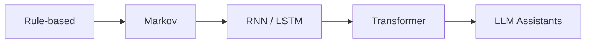

  <h1>Text Machines, Real Art</h1>
  
How language models became an artistic medium

  AI Curriculum · D&K · 2026

  
    Photo by <a href="https://unsplash.com/@ktfrancis?utm_source=unsplash&utm_medium=referral&utm_content=creditCopyText">K.T. Francis</a> on <a href="https://unsplash.com/photos/a-very-tall-building-with-lots-of-windows-C6tq2KT4Lzg?utm_source=unsplash&utm_medium=referral&utm_content=creditCopyText">Unsplash</a>
  

<!--
Presenter notes:
- Open with: "Today, no image generators. Only text as medium."
- Ask: "When does generated language become art?"
-->

---

# Why artists should care

- New medium for text, image, sound, and concept generation
- Fast ideation partner for variations and constraints
- Also a mirror of culture, bias, and internet aesthetics
- Changes authorship, process, and critique workflows
- You still own taste, direction, and final responsibility

<!--
Presenter notes:
- Emphasize leverage: speed in exploration, not replacement of artistic intent.
- Ask: "Where in your process do you get blocked?"
- Connect to sketching: LLMs can be cognitive sketchbooks.
-->

---
layout: two-cols
layoutClass: gap-14
---

# Agenda

- Short history of text generation
- How LLM assistants are trained
- Why hallucinations happen
- Studio experiments with prompts
- Authorship, ethics, and critique

::right::

## Session outcome

By the end, you can:

- Explain the 3 training stages
- Design better creative prompts
- Build an LLM-assisted studio loop
- Spot and manage failure modes

<!--
Presenter notes:
- Set expectation: concept-first, technical depth only where useful.
- Mention this is lecture + studio mindset, not just software tutorial.
-->

---
layout: image-right
image: "./public/images/mohamed-marey-u6zbXHo5MB8-unsplash.jpg"
---

# Before LLMs

- **Markov chains**: probabilistic word transitions
- **ELIZA (1960s)**: scripted conversational illusion
- Rule-based systems felt intelligent in narrow contexts
- Early lesson: plausible language ≠ understanding

  
    Photo by <a href="https://unsplash.com/@abushihabmarey?utm_source=unsplash&utm_medium=referral&utm_content=creditCopyText">Mohamed Marey</a> on <a href="https://unsplash.com/photos/a-close-up-of-an-old-fashioned-typewriter-u6zbXHo5MB8?utm_source=unsplash&utm_medium=referral&utm_content=creditCopyText">Unsplash</a>
  

<!--
Presenter notes:
- Keep this slide short and narrative.
- Make analogy: collage logic in text systems.
- Bridge: modern models scale this idea with huge data + neural training.
-->

---

# Neural shift: RNN → Transformer

- RNN/LSTM improved sequence modeling but struggled with long context
- Transformer introduced attention across all tokens
- Better parallel training on GPUs
- Enabled scale: billions of parameters, trillions of tokens

# Evolution

<!--
Presenter notes:
- "Attention" can be explained as dynamic relevance weighting.
- Do not dive into equations; keep focus on capability jump.
-->

---

# The 3-stage training pipeline

1. **Pre-training**: learn internet-scale language statistics
2. **Post-training (SFT)**: learn assistant behavior from curated dialogues
3. **Reinforcement learning**: optimize for better task performance

 

> Think of it as: reading → guided examples → practice.

<!--
Presenter notes:
- This is the backbone slide. Return to it throughout the talk.
- Compare with art school workflow: references, tutorials, critique cycles.
-->

---
layout: two-cols
layoutClass: gap-14
---

# Stage 1: Pre-training

- Crawl + filter massive web text
- Tokenize text into model-readable units
- Train next-token prediction objective
- Update billions of parameters via gradient descent
- Output: a **base model**

::right::

## Cultural compression

- Parameters become lossy memory of patterns
- Captures style, structure, and associations
- Includes quality + bias from source data
- Powerful, but not truth-verified

<!--
Presenter notes:
- Use phrase from source: "lossy compression of the internet".
- Stress that filtering helps but does not remove all social bias.
-->

---

# What a base model is (and is not)

- A statistical text simulator
- Great at continuation and style mimicry
- Can be coherent, creative, and wrong
- Not yet an aligned assistant
- Not a stable identity or self-aware agent

<!--
Presenter notes:
- Mention GPT-2 as historical anchor from the source material.
- Clarify: base model can imitate chat format but may drift.
-->

---
layout: two-cols
layoutClass: gap-14
---

# Stage 2: Post-training (SFT)

- Replace web corpus with human-written conversations
- Train on "ideal assistant" responses
- Use special role tokens (user/assistant/system)
- Encode helpful, truthful, harmless behavior

::right::

## Design implication

- Assistant style is learned, not magical
- It reflects labeler instructions and examples
- Modern pipelines mix human + synthetic dialogues

<!--
Presenter notes:
- Key quote to paraphrase: you're interacting with a simulation of labeling policy.
- Discuss how "voice" can be engineered through data.
-->

---

# Stage 3: Reinforcement Learning (RL)

- Model generates many candidate answers for a task
- System rewards outputs that reach correct or preferred outcomes
- Training increases probability of successful token paths
- Effect: better reliability and more self-checking reasoning traces

> School analogy: reading (pre-training) → worked examples (SFT) → practice (RL)

<!--
Presenter notes:
- Emphasize RL as "practice with feedback", not hand-written reasoning steps.
- Art bridge: similar to iterative studio critique loops with selection pressure.
-->

---
layout: image-right
image: "https://images.unsplash.com/photo-1575191832807-0c101537b862?auto=format&fit=crop&w=1400&q=80"
---

# Hallucination: aesthetic power, factual risk

- Model predicts plausible tokens, not verified truth
- If uncertainty is unseen in training, confidence is overproduced
- Can fabricate names, facts, citations, biographies
- In art, fiction can be useful; in research, it is dangerous

<!--
Presenter notes:
- Use the source example pattern: fake person gets confident conflicting bios.
- Ask class: where is ambiguity productive vs unacceptable?
-->

---

# Mitigations and tools

- Train explicit "I don't know" behavior
- Route questions to web search when freshness matters
- Use code interpreter for counting/math/logic checks
- Put trusted material in context window
- Treat outputs as draft, then verify

<!--
Presenter notes:
- Distinguish parameters (vague memory) vs context (working memory).
- Practical rule: if stakes are high, require evidence trace.
-->

---

# Models need tokens to think

- Each generated token gets finite compute
- Complex reasoning unfolds across multiple tokens
- Better prompts create better reasoning trajectories
- Ask for steps, criteria, and self-checks

<v-click>

### Prompt upgrade pattern

From: *"Give me a concept."*  
To: *"Give 3 concepts, each with mood, medium, and critique risks."*

</v-click>

<!--
Presenter notes:
- Link to artistic method: constraints create better form.
- Demonstrate how prompt structure changes output quality.
-->

---

# LLMs in art and design

- Short history of text-generating machines
- Real text-based AI artworks and performances
- Why this matters for authorship and style

<!--
Presenter notes:
- Promise a visual, fast, fun session.
- Mention: less theory, more concrete works.
-->

---
layout: two-cols
layoutClass: gap-14
---

# Timeline

Short history of LLM art experiments:

1. **1966** — ELIZA
2. **1984** — Racter book
3. **2010s** — neural text generation
4. **2016** — AI screenplay (*Sunspring*)
5. **2018+** — long-form LLM writing projects

::right::

# Core idea

Machines moved from:

- scripted dialogue
- to statistical word prediction
- to creative co-writing systems

<!--
Presenter notes:
- Keep this as the map for all following case studies.
-->

---
layout: image-right
image: "./public/images/eliza.jpg"
---

# ELIZA (1966)

- Early chatbot by Joseph Weizenbaum
- Used pattern rules, not understanding
- Still created strong emotional response in users

🔗 [Wiki Page](https://en.wikipedia.org/wiki/ELIZA)

  
    Photo By Marcin Wichary from San Francisco, Calif. - Flickr, CC BY 2.0
  

<!--
Presenter notes:
- Emphasize "performance of understanding".
- Ask students: is illusion alone artistically valid?
-->

---
layout: image-right
image: "./public/images/racter-amiga-title-screen.png"
---

# Racter (1984)

- *The Policeman's Beard is Half Constructed*
- Famous early machine-generated text publication
- Mix of absurdity, poetry, and glitchy narrative voice

🔗 [Wiki Page](https://en.wikipedia.org/wiki/The_Policeman%27s_Beard_Is_Half_Constructed)

  
    © 1999–2026 MobyGames
  

<!--
Presenter notes:
- Frame as proto-generative literature.
- Contrast with human surrealist writing traditions.
-->

---
layout: image-right
image: "./public/images/botnik.png"
---

# Botnik Studios

- Human+machine collaborative writing collective
- Uses predictive text tools for comedy/satire
- Strong example of curated co-authorship

🔗 https://botnik.org/

  
    © 2018 botnikstudios
  

<!--
Presenter notes:
- Important: artists are editors/directors, not passive users.
- This is closer to studio practice than "press button" AI.
-->

---
layout: image-right
image: "./public/images/sunspring_01.webp"
---

# *Sunspring* (2016)

- Short film with screenplay generated by an LSTM model
- Human actors perform strange machine-written dialogue
- Shows friction between syntax, meaning, and performance

🎬 [Video](https://www.youtube.com/watch?v=LY7x2Ihqjmc)

  
    © info@endcue.com
  

<!--
Presenter notes:
- Great "fun" moment in class: read one line out loud.
- Discuss: is this bad writing, or new theater language?
-->

---
layout: image-right
image: "https://images.unsplash.com/photo-1555949963-aa79dcee981c?auto=format&fit=crop&w=1400&q=80"
---

# Ross Goodwin, *1 the Road*

- Road-trip book generated with a custom neural writing system
- Combines sensors, location data, and machine text output
- Documents machine perception as literary form

🔗 [Wiki Page](https://en.wikipedia.org/wiki/1_the_Road)

<!--
Presenter notes:
- Emphasize process as artwork, not only final text.
- Connect to conceptual art and procedural writing.
-->

---
layout: image-right
image: "https://images.unsplash.com/photo-1535378917042-10a22c95931a?auto=format&fit=crop&w=1400&q=80"
---

# PoemPortraits (2019)

- Es Devlin + Google Arts & Culture
- Public contributes a word, system returns a generated verse
- Participatory poetry as installation experience

🔗 [Doc](https://artsandculture.google.com/experiment/poemportraits)

<!--
Presenter notes:
- Highlight interaction design: audience becomes co-writer.
- Good bridge to participatory and relational art.
-->

---

# Why these works matter

- They expose the boundary between generation and intention
- They make process visible: prompting, curation, performance
- They question authorship, labor, and originality
- They turn "errors" into aesthetic material

<!--
Presenter notes:
- Tie back to course themes: critical making, not tool worship.
-->

---
layout: center
class: text-center
---

# Closing

### LLMs don't replace literary art.
### They expand the space of textual performance.

 

Takeaway: Use LLM text critically — as material, partner, and provocation.

<!--
Presenter notes:
- End on empowerment and curiosity.
-->
